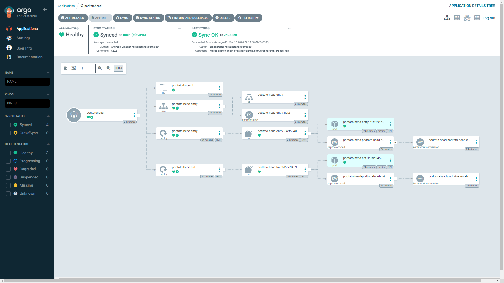
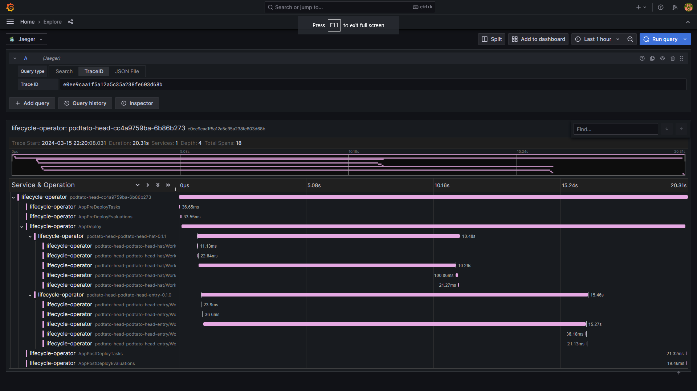
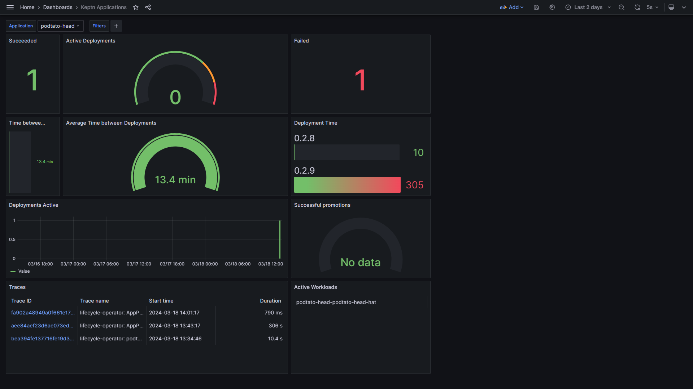
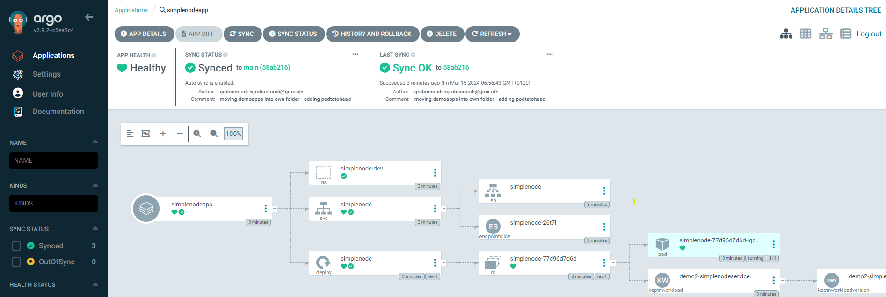
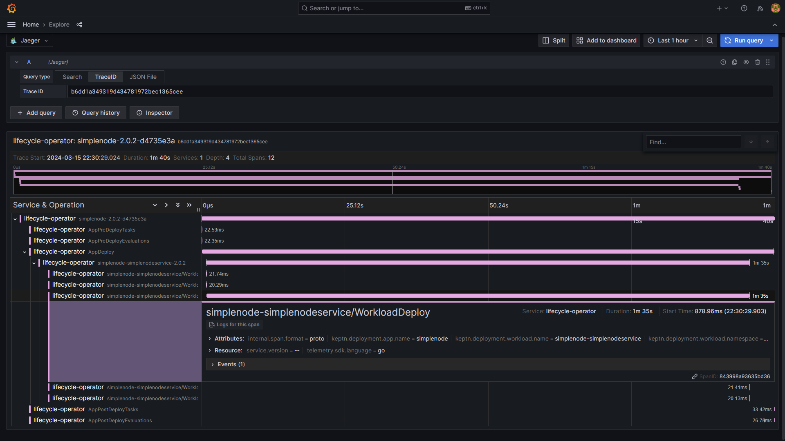

# Argo CD and Keptn Demo for ArgoCon 2024

This is the companion demo for the ArgoCon 2024 talk [Why is it taking that long? Shining the light on Application Syncs in Argo with Keptn](https://colocatedeventseu2024.sched.com/event/1YFh1/why-is-it-taking-so-long-shining-the-light-on-application-syncs-in-argo-cd-with-keptn-christian-hernandez-akuity-andreas-grabner-dynatrace)

The goal of this demo is to show how Keptn creates OpenTelemetry traces and prometheus metrics to provide observability driven answers to questions like:
* How many applications and workloads are getting deployed?
* How long do deployments take and whats the success rate?
* Whats the root cause of slow or failing deployments?

This demo installs ArgoCD which then installs a set of platform tools such as OpenTelemetry, Jaeger, Grafana, Keptn and some demo apps to demo the observability insights Keptn provides. Here is a screenshot showing one of the apps shown in ArgoCD and the corresponding OpenTelemetry trace that gives insights into what the K8s Pod Scheduler did to fulfill the deployment request!

ArgoCD showing Podtatehead application


Jaeger OpenTelemetry Trace in Grafana for the same application


Grafana dashboard with some deployment metrics and access to traces



## Bootstrapping Argo CD
```
kind create cluster --config kind-cluster.yaml
kubectl apply -k argocd
kubectl apply -f apps.yaml
```

This example includes a `devcontainer` configuration, allowing you to automatically create an environment for testing using the VSCode Dev Containers extension or GitHub Codespaces.

## Accessing the Argo CD UI
Navigate to [https://localhost:8080/](https://localhost:8080/) on the machine with the `kind` cluster running.

Get the generated `admin` password.
```
argocd admin initial-password -n argocd
```

Or:
```
cat ~/argo-cd-admin-password.txt
```

Or: 
```
ARGOCDPWD=$(kubectl -n argocd get secret argocd-initial-admin-secret -o jsonpath="{.data.password}" | base64 -d)
echo $ARGOCDPWD
```

## Accessing the Grafana UI
Navigate to [https://localhost:8082/](https://localhost:8082/) on the machine with the `kind` cluster running (the dev container also forwards this port).

The username and password are `admin`.

## Clean Up
```
kind delete cluster --name argocd-keptn
```

## Examples

> Keptn has created a resource called a KeptnApp to track your application. The name of which is 
based on the part-of label.

```
$ kubectl -n demo get keptnapp
NAME           AGE
keptndemoapp   3m20s
```

> Keptn also creates a new application version every time you increment the version label.
>
> The PHASE will change as the deployment progresses. A successful deployment is shown as PHASE=Completed

```
$ kubectl -n demo get keptnappversion
NAME                          APPNAME        VERSION   PHASE
keptndemoapp-0.0.1-6b86b273   keptndemoapp   0.0.1     Completed
keptndemoapp-0.0.2-d4735e3a   keptndemoapp   0.0.2     Completed
```

> Keptn is generating DORA metrics and OpenTelemetry traces for your deployments.
> 
> These metrics are exposed via the Keptn lifecycle operator /metrics endpoint on port 2222.
> 
> To see these raw metrics:

```
SERVICE=$(kubectl get svc -l control-plane=lifecycle-operator -A -ojsonpath="{.items[0].metadata.name}")
kubectl -n keptn-lifecycle-toolkit-system port-forward svc/$SERVICE 8081:2222
```

> Access metrics in Prometheus format on [http://localhost:8081/metrics](http://localhost:8081/metrics)
> 
> Look for metrics starting with keptn_

## More demo apps

> You can deploy two additional demo applications provided by this repository
> Simplenode (single node.js based microservice) and [Podtatohead](https://github.com/podtato-head) (the sample app of TAG AppDelivery)

```
kubectl apply -f simplenodeapp.yaml
kubectl apply -f podtatoheadapp.yaml
```

## additional screenshots from this demo





